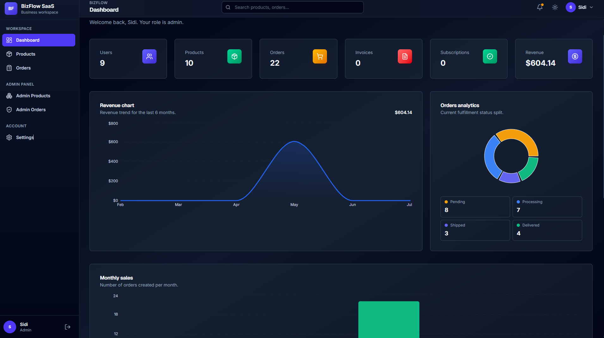
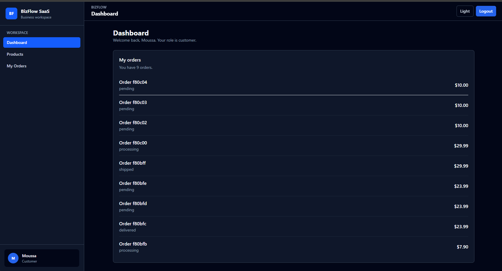
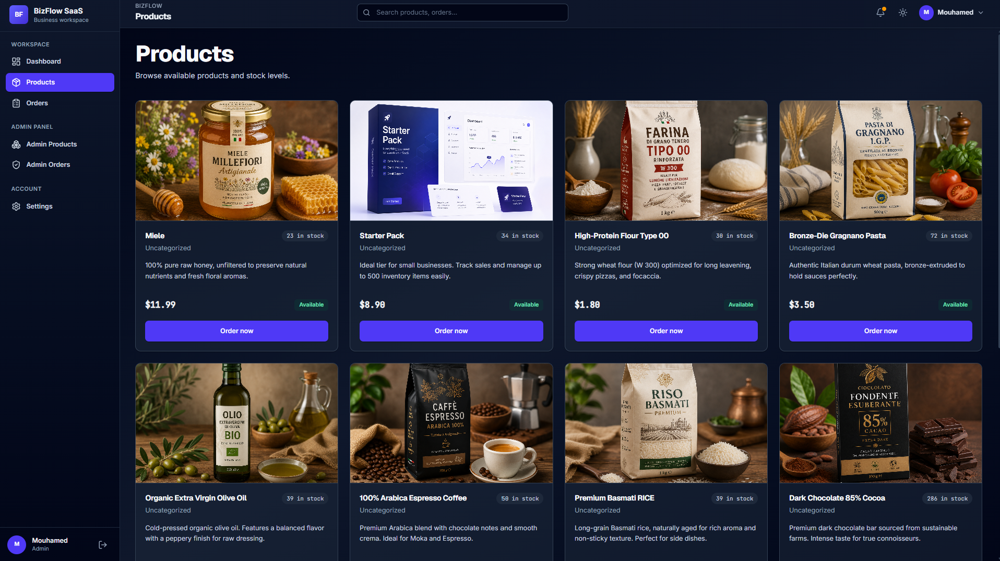
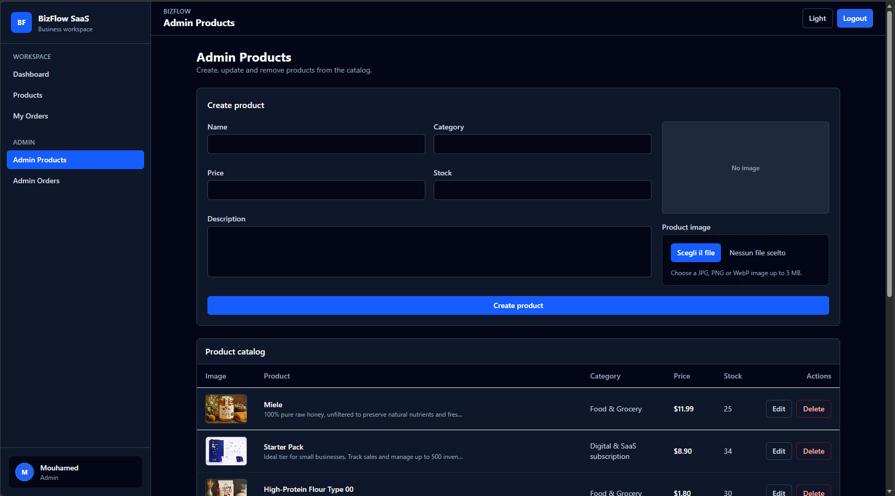
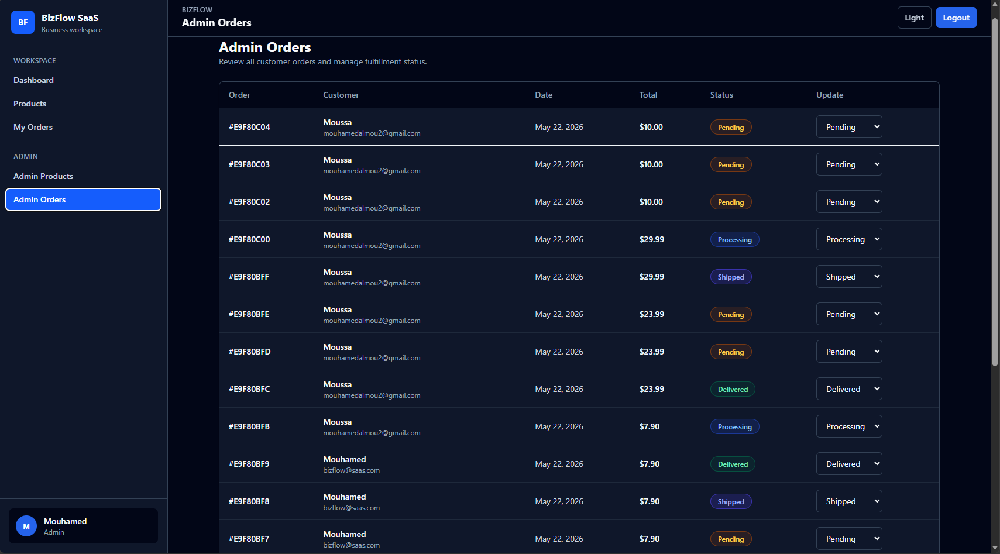

# BizFlow SaaS




Modern full-stack MERN SaaS platform for inventory management, product ordering, customer dashboards, and admin analytics.

This project demonstrates a production-ready MERN SaaS deployment workflow using AWS EC2, Docker, Nginx, HTTPS, and MongoDB Atlas.

---

# Live Demo

Frontend:  
https://bizflowsaas.duckdns.org


Backend API:
https://bizflowsaas.duckdns.org/api/products

---

# Production Deployment

- AWS EC2 Ubuntu Server
- Docker & Docker Compose
- Nginx Reverse Proxy
- HTTPS SSL with Let's Encrypt
- MongoDB Atlas
- DuckDNS custom domain

---

# Production Architecture

```txt
Client Browser
|
v
Nginx Reverse Proxy (HTTPS)
|
v
React Frontend Container
|
v
Express API Container
|
v
MongoDB Atlas
```

BizFlow is deployed as a containerized production application on a Linux server. Nginx terminates HTTPS traffic, serves the public domain, and routes API requests to the backend container while the React frontend runs in its own containerized environment.

## Infrastructure Highlights

- Dockerized frontend and backend services
- HTTPS production environment with Let's Encrypt
- Nginx reverse proxy routing for `/` and `/api`
- MongoDB Atlas cloud database
- AWS S3 image storage for product uploads
- Linux server deployment on AWS EC2
- DuckDNS domain connected to the EC2 instance

---

# Screenshots

## Dashboard Analytics

File: `screenshots/dashboard.png`


- Revenue analytics
- Orders analytics
- Monthly sales charts
- SaaS admin overview

## Customer Dashboard

File: `screenshots/dashboard-client.png`



## Dashboard Overview

File: `screenshots/dashboard (2).png`

.png>)

## Products Page

File: `screenshots/products.png`



- Product catalog
- AWS S3 image integration
- Inventory tracking
- Order workflow

## My Orders

File: `screenshots/my orders.png`


## Admin Products

File: `screenshots/admin-products.png`



- Create products
- Edit products
- Delete products
- Image upload to AWS S3

## Admin Orders

File: `screenshots/admin-orders.png`



- Customer order management
- Order status workflow
- Fulfillment dashboard

---

# Features

## Authentication & Security

- JWT authentication
- Protected routes
- Role-based authorization
- Admin / Customer permissions
- Persistent login with localStorage
- Backend route protection

## Product Management

- Product CRUD operations
- Product stock management
- AWS S3 image upload
- Product categories
- Dynamic inventory updates

## Orders System

- Create customer orders
- Customer order history
- Admin order management
- Order lifecycle tracking:
  - Pending
  - Processing
  - Shipped
  - Delivered

## Dashboard Analytics

- Revenue charts
- Orders analytics
- Monthly sales visualization
- Business statistics cards

## UI / UX

- Modern dark SaaS UI
- Responsive design
- Sidebar navigation
- Loading states
- Toast notifications
- Image previews
- Empty states
- Mobile-friendly layout

---

# Tech Stack

## Frontend

- React
- Vite
- Tailwind CSS
- React Router DOM
- Axios
- Context API
- Recharts
- React Hot Toast

## Backend

- Node.js
- Express.js
- MongoDB Atlas
- Mongoose
- JWT
- bcryptjs
- multer
- AWS SDK v3

## Cloud & DevOps

- AWS S3
- AWS EC2
- MongoDB Atlas
- Docker
- Docker Compose
- PM2
- Nginx
- Let's Encrypt SSL
- DuckDNS

## Cloud Services

- AWS EC2 (production server)
- AWS S3 (product image storage)
- MongoDB Atlas (database)
- Nginx reverse proxy
- Let's Encrypt HTTPS
- Docker & Docker Compose

---

# Architecture

## Frontend

- React SPA with protected routes
- Context API authentication
- Axios API integration
- Responsive dashboard UI

## Backend

- REST API with Express
- JWT authentication middleware
- MongoDB relational schemas
- Admin authorization system

## Cloud

- AWS S3 image storage
- MongoDB Atlas cloud database

## Deployment

- Full application deployed on AWS EC2
- Frontend and backend run as Docker containers
- Nginx handles HTTPS and reverse proxy routing
- MongoDB Atlas provides the production database
- DuckDNS provides the public production domain

---

# Authentication Flow

1. User registers an account.
2. Password is hashed using bcryptjs.
3. Email verification token is generated.
4. User verifies email through a secure verification link.
5. User logs in and receives a JWT token.
6. Token is stored in localStorage.
7. Protected routes verify authentication.
8. Admin middleware restricts admin-only routes.
9. Password reset flow sends secure email reset links.

---

# AWS S3 Image Upload

BizFlow supports real cloud image uploads using AWS S3.

Workflow:

1. Admin selects an image from the local machine.
2. Frontend uploads the image using FormData.
3. Express backend processes the upload with multer.
4. AWS SDK uploads the image to the S3 bucket.
5. Image URL is returned to the frontend.
6. MongoDB stores the S3 image URL.
7. Product cards display cloud-hosted images.

---

# Folder Structure

## Frontend

```txt
src/
|-- api/
|-- components/
|-- context/
|-- pages/
|-- routes/
|-- utils/
`-- App.jsx
```

## Backend

```txt
src/
|-- config/
|-- controllers/
|-- middleware/
|-- models/
|-- routes/
`-- server.js
```

---

# Contact Me

- LinkedIn: https://www.linkedin.com/in/almou-inguidazane-mouhamed

---

# Installation

## Clone Repository

```bash
git clone https://github.com/yourusername/bizflow-saas.git
cd bizflow-saas
```

---

# Backend Setup

```bash
cd backend
npm install
npm run dev
```

---

# Frontend Setup

```bash
cd frontend
npm install
npm run dev
```

---

# Environment Variables

## Backend `.env`

```env
PORT=5000
MONGO_URI=your_mongodb_connection
JWT_SECRET=your_jwt_secret
CLIENT_URL=http://localhost:5173

AWS_REGION=your_region
AWS_BUCKET_NAME=your_bucket_name
AWS_ACCESS_KEY_ID=your_access_key
AWS_SECRET_ACCESS_KEY=your_secret_key
```

## Frontend `.env`

```env
VITE_API_URL=http://localhost:5000/api
```

---

# API Routes

## Auth

```txt
POST /api/auth/register
POST /api/auth/login
GET  /api/auth/me
```

## Products

```txt
GET    /api/products
POST   /api/products
PUT    /api/products/:id
DELETE /api/products/:id
```

## Orders

```txt
POST /api/orders
GET  /api/orders/my-orders
GET  /api/orders
PUT  /api/orders/:id/status
```

## Dashboard

```txt
GET /api/dashboard/stats
GET /api/dashboard/recent-orders
```

## Users Admin

```txt
GET    /api/users
GET    /api/users/:id
PUT    /api/users/:id
DELETE /api/users/:id
```

## Invoices

```txt
POST /api/invoices/from-order
GET  /api/invoices
GET  /api/invoices/my-invoices
```

## Subscriptions

```txt
GET  /api/subscriptions/plans
POST /api/subscriptions
GET  /api/subscriptions/my-subscription
GET  /api/subscriptions
PUT  /api/subscriptions/:id/status
```

## Upload

```txt
POST /api/upload/image
```

---

# Future Improvements

- Stripe payments
- Email notifications
- Multi-vendor support
- Real-time analytics
- WebSocket notifications
- Advanced reporting
- AI-powered inventory insights

---

# Learning Goals

This project was built to practice and improve:

- MERN stack architecture
- Full-stack authentication
- AWS cloud integration
- Docker workflows
- Production-ready UI / UX
- REST API design
- Real-world debugging
- SaaS application structure

---

# Author

Mouhamed Almou Inguidazane

Full-Stack MERN Developer

GitHub:  
https://github.com/mouhamedalmou

LinkedIn:  
https://www.linkedin.com/in/almou-inguidazane-mouhamed
